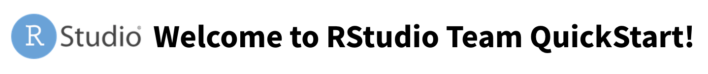
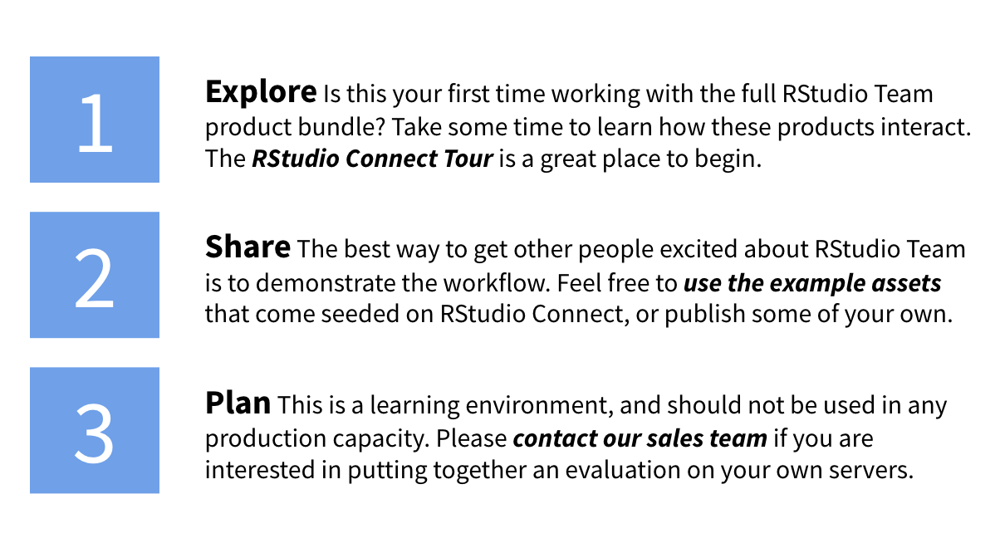
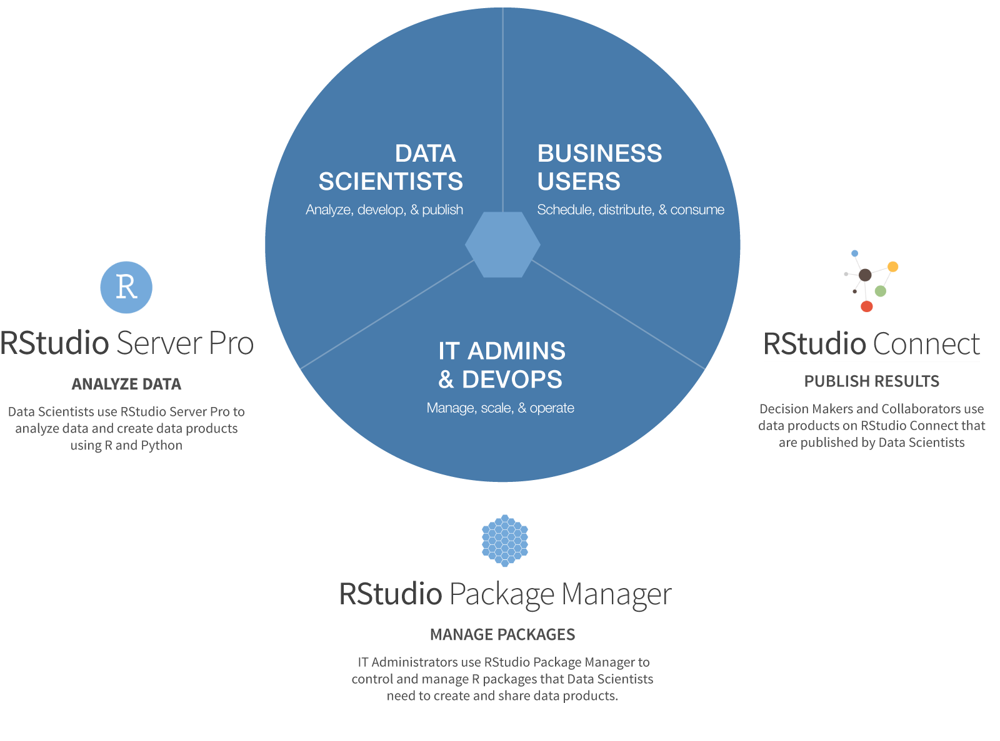

<!--html_preserve-->

<!--/html_preserve-->

<!--html_preserve-->

  

    

  

  

      
    

      <a class="btn btn-primary btn-lg" href="tour.html" role="button">RStudio Connect Tour</a>
    

      
    

         
    

      
    

      <a class="btn btn-default btn-lg" href="https://www.rstudio.com/about/contact-sales/" role="button">Contact Sales</a>
    

  

<!--/html_preserve-->

### Quick Links

<!--html_preserve-->

<a class="btn btn-default btn-lg" href="rstudio/" target="_blank" role="button" data-toggle="tooltip" data-placement="bottom" title="Default Username: rstudio Default Password: rstudio">RStudio Server Pro</a>
  <a class="btn btn-primary btn-lg" href="rsconnect/" target="_blank" role="button" data-toggle="tooltip" data-placement="bottom" title="Default Username: rstudio Default Password: rstudio">Log in to RStudio Connect &raquo;</a>
  <a class="btn btn-default btn-lg" href="packages/" target="_blank" role="button">Package Manager</a>

  

  <a class="btn btn-default" href="rstudio/" target="_blank" role="button" data-toggle="tooltip" data-placement="bottom" title="Default Username: rstudio Default Password: rstudio">RStudio Server Pro</a>
  <a class="btn btn-default" href="rsconnect/" target="_blank" role="button" data-toggle="tooltip" data-placement="bottom" title="Default Username: rstudio Default Password: rstudio">RStudio Connect</a>
  <a class="btn btn-default" href="packages/" target="_blank" role="button">Package Manager</a>
  <a class="btn btn-default" href="webmail/" target="_blank" role="button">Webmail</a>
  <a class="btn btn-default" href="help.html" role="button">Help</a>

<!--/html_preserve-->

### RStudio Team

RStudio Team is a bundle of RStudio’s popular professional software for statistical data-analysis, package management, and sharing data products. RStudio Team includes RStudio Server Pro, RStudio Package Manager, and RStudio Connect. 

<!--html_preserve-->

<!--/html_preserve-->

### RStudio Team QuickStart VM - Intended Use

RStudio Team QuickStart is primarily intended as a demo environment and is **not** supported for use in any production capacity. For more information about using RStudio Professional products on your own enterprise infrastructure, please [contact our sales team](https://www.rstudio.com/about/contact-sales/).

