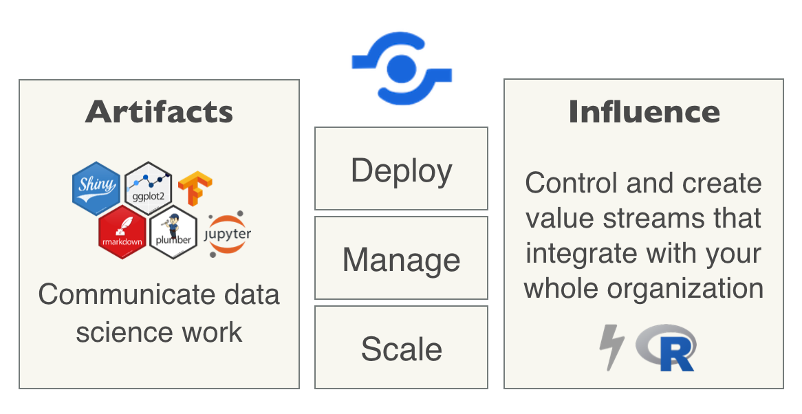

<!--html_preserve-->
<html>
<head>

 
</head>

<body>

  

    

      

        

        
          <h3>Why Use RStudio Connect?</h3>
          
          <blockquote>
            
<i>It doesn’t matter how great your analysis is unless you can explain it to others: you need to communicate your results.</i>

            <small>Grolemund & Wickham in <cite title="R For Data Science"><a href="https://r4ds.had.co.nz/">R For Data Science</a></cite></small>
          </blockquote>
          
        

      

      

        
        
         
        <h4 style="text-align:center">RStudio Connect is a publishing platform that makes sharing data science simple</h4>
        
      

    

  

  

      

        <h3 style="color:orange; text-align:center;">Plan &amp; Integrate</h3>
        <ul>
          <li>
            <a href="resource-pages/evaluation-tips.html">Tips for planning your evaluation</a>
          </li>
          <li>
            <a href="https://www.rstudio.com/wp-content/uploads/2018/06/RStudio_Connect_ITQA_180618.pdf">What IT needs to know</a>
          </li>
          <li>
            <a href="http://docs.rstudio.com/connect/user/connecting.html">Connecting from the RStudio IDE</a>
          </li>
        </ul>
        
        <h3 style="color:green; text-align:center;">Publish</h3>
        <ul>
          <li>
            <a href="https://support.rstudio.com/hc/en-us/articles/228270928-Push-button-publishing-to-RStudio-Connect">Developer-driven publishing</a>
          </li>
          <li>
            <a href="http://docs.rstudio.com/connect/user/publishing.html#collaboration">Collaborative Publishing</a>
          </li>
          <li>
            <a href="http://docs.rstudio.com/connect/user/cookbook.html">Programmatic publishing workflows</a>
          </li>
        </ul>
      

      
      

      
      <h3 style="color:red; text-align:center;">Create</h3>
        <ul>
          <li>
            <a href="https://support.rstudio.com/hc/en-us/articles/360007981134-Persistent-Storage-on-RStudio-Connect">Persistent data storage</a>
          </li>
          <li>
            <a href="https://support.rstudio.com/hc/en-us/articles/226871847-Process-management-in-RStudio-Connect">Process management and sandboxing</a>
          </li>
        </ul>
      
      <h3 style="color:blue; text-align:center;">Configure &amp; Leverage</h3>
        <ul>
          <li>
            <a href="http://docs.rstudio.com/connect/user/content-metadata.html">Setup content metadata</a>
          </li>
          <li>
            <a href="http://docs.rstudio.com/connect/user/api-keys.html">Programmatic access with API keys</a>
          </li>
          <li>
            <a href="http://docs.rstudio.com/connect/user/r-markdown.html#r-markdown-schedule">Scheduling</a>
          </li>
          <li>
            <a href="http://docs.rstudio.com/connect/user/shiny.html#shiny-application-usage">Track content usage metrics</a>
          </li>
          <li>
            <a href="https://support.rstudio.com/hc/en-us/articles/228449348-How-do-I-delete-a-document-on-RStudio-Connect-">How to delete/remove content</a>
          </li>
        </ul>
      

  

  
   
  
    

      

        <h3 align="center">Manage &amp; Administer RStudio Connect</h3>
        

        

          

            <a class="btn btn-info" href="http://docs.rstudio.com/connect/admin/" role="button">RStudio Connect Admin Documentation</a>
          

          

            <a class="btn btn-info" href="https://support.rstudio.com/hc/en-us/sections/205987508-RStudio-Connect" role="button">Curated RStudio Connect Support Docs</a>
          

        

        
      

    

  

  
</body></html>
<!--/html_preserve-->