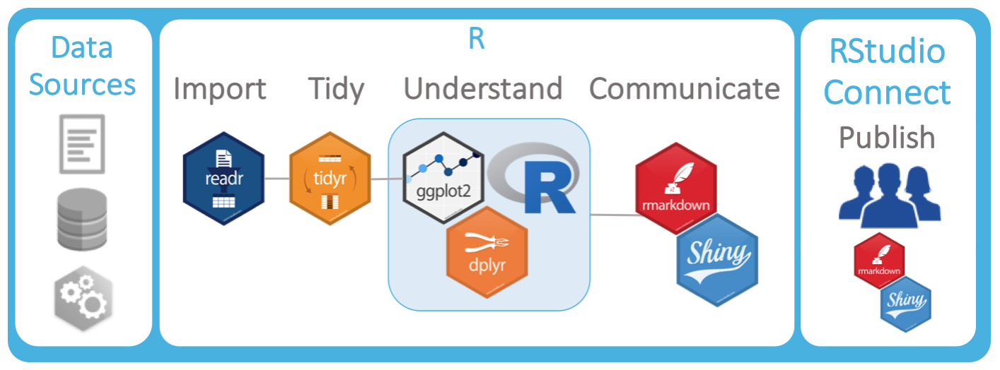

<!--html_preserve-->
<html>
<head>

 
</head>
<body>

  

    

      <h2>45 Days with the RStudio Professional Quickstart</h2>
      

      

        

          
<b>You’ve heard about RStudio Connect and believe that it could add value to your data science group.</i></b> 
          
Downloading and installing the RStudio Professional Quickstart is the first step! But what should you plan to do next? Here are some tips for how get the most out of the RStudio 45-day evaluation period.

        

        

          
        

    

  
  

</body>
</html>
<!--/html_preserve-->        

## Stage 1: Exploring Value

#### _Evaluate: Does this product help R users deliver more valuable analytic content to stakeholders at your organization?_

**Tasks:**

- Test the features of RStudio Connect for yourself
- Explore the demo content that comes pre-deployed with the RStudio Professional Quickstart
- Create and Deploy some of your own assets (Shiny apps, R Markdown docs, Plumber APIs…)
- [Schedule a demo of RStudio Connect](https://rstudio.youcanbook.me/) for your data science team

**Questions:**

- Is this something that would add value to your data science team?
- Does your organization have a process for onboarding new software through official channels? 
- What do you need to have in place to kick-off an official evaluation or onboarding process?

**Resources:**

- [RStudio Connect Admin Guide](http://docs.rstudio.com/connect/admin/)
- [RStudio Connect User Guide](http://docs.rstudio.com/connect/user/)
- RStudio Connect [Feature Demo Webinar](https://www.rstudio.com/resources/webinars/the-tidyverse-and-rstudio-connect/)
- RViews Blog: [Make R a Legitimate Part of Your Organization](https://rviews.rstudio.com/2016/11/16/make-r-a-legitimate-part-of-your-organization/)
- RViews Blog: [A Data Science Lab for R](https://rviews.rstudio.com/2017/12/20/rstudio-server-quick-start/)

## Stage 2: Proving Process

#### _Evaluate: Will this product fit your current or desired data science workflow and process goals?_

The purpose of this stage is to build a business case for the adoption of RStudio Connect. If you've proved that RStudio Connect adds value to yourself, now is the time to prove it to others. Create an RStudio "roadshow" within your organization. Have your data science team try out the publishing and content management features; just make sure they know that what they’re working in a sandbox. Demo your proof of concept (POC) to management stakeholders. At this stage, showing actual insights and applications produced from the data science team will likely communicate more value than showing the fake/demo content that comes pre-deployed with the Quickstart.

**Tasks:**

- Invite the data science team to brainstorm some simple demo assets for "roadshow" deployment 
  - Note that the the RStudio Professional Quickstart should not support production assets
  - Use simple datasets for best results, as connecting to outside data sources could be difficult or unsupported in the Quickstart 
- Coach the team through sections of the [RStudio Connect User Guide](http://docs.rstudio.com/connect/user/)
- As a team, think about how Connect will integrate with or change current result delivery or communication workflows
- Schedule your roadshow demos to establish executive or management-level buy-in for RStudio Connect
  - Note that you can [request demos and resources](https://rstudio.youcanbook.me/) from the RStudio Sales team at any time

## Stage 3: Testing Configuration

#### _Evaluate: Can this product be configured to work given your infrastructure, architecture and security needs?_

At this point, it's time to reconcile the _business user goals_ defined in stages 1 and 2, with _security and infrastructure goals_ as defined by your IT group. **At this stage, you'll move off of the Quickstart and into a new [45-day fully configurable and full-featured product evaluation](https://www.rstudio.com/products/connect/evaluation/).**

Starting the 45-day full-featured product evaluation likely means involving the people who make and maintain analytic infrastructure decisions at your organization. The [RStudio Connect Admin Guide](http://docs.rstudio.com/connect/admin/) is the best resource for parsing configuration options and designing an installation recipe. Architecture and security requirements will drive the conversation around which RStudio Connect licensing model your organization should persue. This is why it is very important to involve your IT team in any planning and evaluation check-in calls you have with the RStudio Sales team. Also note that the 45-day full-featured product evaluation comes with access to RStudio professional email-based support which can be a great resource for your IT team as they iterate through the installation and configuration process.  

**Tasks:**

- Work with the IT team to set expectations around the administration of R and RStudio products
- [Download](https://www.rstudio.com/products/connect/evaluation/) the 45-day full-featured free trial of RStudio Connect
- Refer IT to the [RStudio Connect Admin Guide](http://docs.rstudio.com/connect/admin/)
- Connect IT with the appropriate support resources when necessary 

**Resources:**

- [What IT needs to know about RStudio Connect](https://www.rstudio.com/wp-content/uploads/2018/06/RStudio_Connect_ITQA_180618.pdf)
- RStudio Sales and Solutions Engineering [Call Scheduling](https://rstudio.youcanbook.me/)
- Email Support: `support@rstudio.com`
- [Curated Support Documents for RStudio Connect](https://support.rstudio.com/hc/en-us/sections/205987508-RStudio-Connect)
- [RStudio Connect Admin Guide](http://docs.rstudio.com/connect/admin/)
- RStudio Webinars: [Connect in Production](https://www.rstudio.com/resources/webinars/administration-of-rstudio-connect-in-production/)

