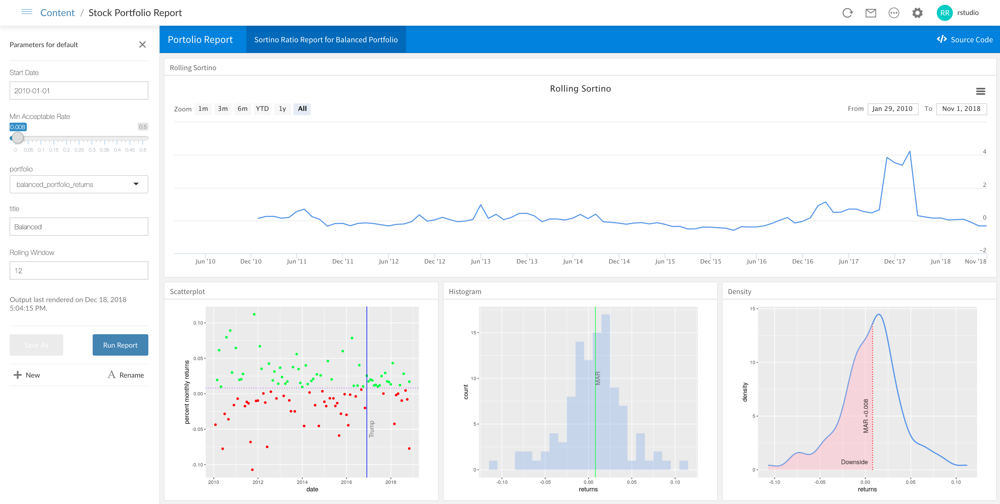
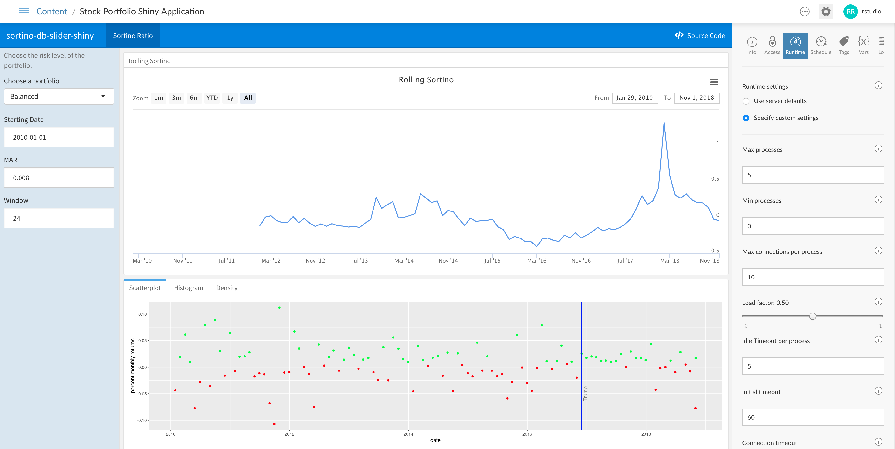
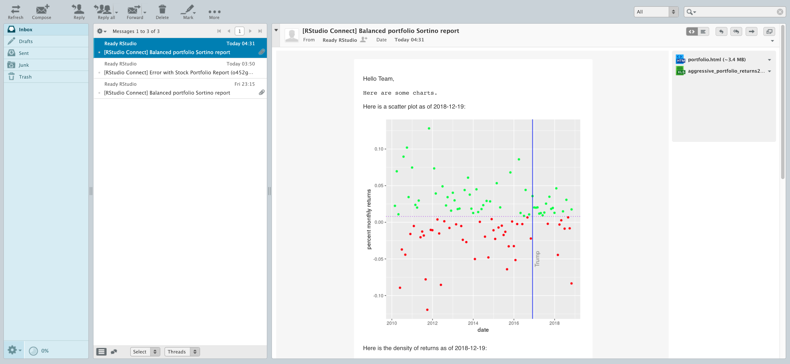

In the following sections, we'll explore the full functionality of RStudio Connect.

You can follow through the tasks in sequential order, starting with user tasks and continuing to administrator tasks. Or, you can jump directly to a task and perform the steps described in that section.

## Getting Started

The RStudio QuickStart is pre-populated with apps, reports, and APIs that have been published.

* **Shiny Apps**. Host, manage, and scale your Shiny applications.
* **R Markdown Documents**. Schedule and distribute your R Markdown documents and reports.
* **Plumber APIs**. Expose any R function as an API.

### Logging in

First, we'll log in and view the data products that have been published to RStudio Connect.

Navigate to the <a href="rsconnect/" target="_blank">RStudio Connect interface</a>.

Click the `Log In` link on the top right corner of the `Welcome to RStudio Connect` page.

Log in with the account username `rstudio` and password `rstudio`, which has administrator priviledges.

### Exploring the landing page

Once you are logged in to RStudio Connect, you'll see a landing page with a list of all of the content that has been published:

### Default accounts and roles

The RStudio QuickStart is pre-populated with multiple users, each with a different role and credentials:

* A **Viewer** can view and interact with content.
    * The username is `viewer` and password is `viewer`.
* A **Publisher** has all the rights of the viewers and can also publish and manage content. 
    * The username is `publisher` and password is `publisher`.
* An **Administrator** has all the rights of the publishers and can also manage users and server settings.
    * The username is `rstudio` and password is `rstudio`.

## Explore Content

### Shiny Application

From the RStudio Connect landing page, click on the published document called `Stock Portfolio Shiny Application`, which will open the published Shiny app in the content portion of the screen along with controls for the application on the right side of the screen.

Explore the published Shiny application by:

1) Hovering over different dates in the time series to view the Sortino Ratio for a given date.
2) Changing the zoom level of the data for different ranges.
3) Switching to different tabs along the bottom to view the data as a scatterplot, histogram, or density plot.
4) Changing the parameters on the left in terms of portfolio risk level, starting date, MAR, and window.

### R Markdown Report

From the RStudio Connect landing page, click on the published document called `Stock Portfolio Report`, which will open the published report in the content portion of the screen along with controls for the application on the right side of the screen.

This R Markdown report is parameterized and can be re-run with different settings and saved, emailed to other collaborators and viewers, or scheduled to be run on a recurring basis.

Explore the published R Markdown Report by:

1) Click on the `Input` drawer on the left side of the screen to view the parameters for the report.
2) Change some of the parameters such as the date or portfolio.
3) Press the `Run Report` button to regenerate the report with the updated parameters.
4) Once the new report is generated, you can press the `Save As` button to save the newly generated report.

### Plumber API

From the RStudio Connect landing page, click on the published API called `Stock Information Plumber API`, which will open the published API and show the endpoints that are available. In this published API, there are two endpoints that can be queried.

Let's query the `/price` endpoint to get historical prices for a given ticker symbol.

1) Click the `/price` bar near the bottom of the screen to expand the details of the endpoint.
2) Click the `Try it Out` button to show the fields for the inputs to the API endpoint.
3) Enter `AAPL` in the `ticker` field.
4) Click the execute button to submit a request to the API endpoint.

The results of the query appear in the response body field, which shows the historical returned as a JSON object. This API could be queried by other published assets or consumed by systems external to RStudio Connect using API tokens.

## User Exercises

RStudio Connect is powered by R, so it knows how to run all of your data products. Perform these tasks in RStudio Connect.

### Adding collaborators

For each deployed project, you can define which types of users can access the published version of content and who can make changes to the content.

Let's add a collaborator to a Shiny app.

1) From the RStudio Connect landing page, click on the published document called `Stock Portfolio Shiny Application`.
2) Click the `Access` tab in the project settings on the right side of the screen.
3) Add the user `publisher` as a collaborator by typing their username in the field under `Who can change this document`.
4) Click the `publisher` user to add them as a collaborator to this project.

Now, the `publisher` user has the ability to manage and update this application.

### Scaling Shiny apps

1) From the RStudio Connect landing page, click on the published document called `Stock Portfolio Shiny Application`.
2) Click the `Runtime` tab in the project settings on the right side of the screen.
3) Under `Runtime settings`, choose the `Specify custom settings` option.
4) Set the `Max processes` to `5`.
5) Set the `Max connections per process` to `10`.
6) Click the `Save` button.

After configuring these new runtime settings, your Shiny app will be able to scale up as needed to handle a higher number of concurrent users and connections.

### Sending reports by email

From the RStudio Connect landing page, click on the published document called `Stock Portfolio Report`, which will open the published report. This parameterized document contains multiple inputs that can be varied, then the report can be re-run and the output can be saved as new versions of the report.

Let's change some of the parameters and send a copy of the report via email.

1) Click the `Input` drawer on the left side of the report.
2) Change the `Start Date` to `2010-02-01`.
3) Change the `portfolio` field to `aggressive_portfolio_returns`.
4) Click the `Run Report` button.
5) After the new output is shown, click the `Save` button, enter a name for the new report, and click `OK`.
6) On the top right navigation bar, click the email icon.
7) Click the `Send` button to send a copy of the report via email.

Navigate to the <a href="webmail/" target="_blank">webmail interface</a> in the QuickStart. You'l see an email that contains the latest results from the report along with attached versions of the report in HTML and spreadsheet format.

### Scheduling report outputs

You can schedule reports to be saved or sent by email to a list of users on a recurring basis.

From the RStudio Connect landing page, click on the published document called `Stock Portfolio Report`.

1) Click the `Schedule` tab in the project settings on the right side of the screen.
2) Check the box to `Schedule output for default`.
3) Choose a `Schedule type` such as `Daily`.
4) Check the option to `Send email after update`.
5) Click the `Save` button, then your report will re-run, publish the new output, and send an email update.

Navigate to the <a href="webmail/" target="_blank">webmail interface</a> in the QuickStart. You'l see an email that contains the latest results from the report along with attached versions of the report in HTML and spreadsheet format.

## Administrator Exercises

The tasks in this section would be performed by an administrator user in RStudio Connect.

### Managing users

From the RStudio Connect landing page, click on the `People` item in the top navigation bar.

You'll see a list of all users who have registered accounts in RStudio Connect.

You can click on a particular user to view a list of content published by that user, and you have the ability to edit fields or lock access to their user account.

### Monitoring usage metrics

From the RStudio Connect landing page, click on the `Admin` item in the top navigation bar.

You'll see an administrator dashboard with information about the CPU and RAM usage on RStudio Connect, the number of active users and Shiny connections, and a list of processes that are running alongside published content.

You can change the range to view RStudio Connect activity in terms of recent hours, days, weeks, and more.

### Setting vanity app URLs

1) From the RStudio Connect landing page, click on the published document called `Stock Information Plumber API`.
2) Click the `Access` tab in the project settings on the right side of the screen.
3) Change the vanity URL for the API to `/stock-portfolio/api/v1/`.
4) Click the `Save` button.

Now, you can access the stock information API by visiting the [new vanity URL](http://localhost:5000/rsconnect/stock-portfolio/api/v1/__swagger__/) in your browser.

### Adding tags to content

From the RStudio Connect landing page, click on the `Admin` item in the top navigation bar, then click the `Tags` item to view a list of tags that have been defined.

1) Add a new category by clicking the `New Category` button on the top right of the screen and entering a name for the category.
2) Add a tag under a category by clicking `New tag` under a category and entering a name for the tag.

Tags can be selected by owners or collaborators on a per-project basis. Users can use these tags from the landing page to filter for certain projects.

The tag schema can be customized in any way that maps to your organization's needs.

### Viewing audit logs

From the RStudio Connect landing page, click on the `Admin` item in the top navigation bar, then click the `Audit Logs` item to view a history of the activity that has been performed on RStudio Connect.

### Viewing system information

From the RStudio Connect landing page, click on the `Documentation` item in the top navigation bar. You can view a list of available R versions that have been configured with RStudio Connect.

Click on the `Server API Reference` link to view documentation related to various APIs that can be used to programmatically obtain audit logs, create published projects, gather statistics for published apps, and more.

## Publishing Content

Push-button publishing is an easy way to publish content from the RStudio IDE or Server Pro to RStudio Connect.

You can configure the RStudio IDE on your local machine to try out publishing of your own content to the instance of RStudio Connect in the QuickStart. Refer to the documentation to connect your [RStudio IDE to RStudio Connect](http://docs.rstudio.com/connect/user/connecting.html).

The URL of your RStudio Connect server in the QuickStart is `http://localhost:5000/rsconnect`.

Once you've connected the account to your RStudio IDE, you can publish content to RStudio Connect.

