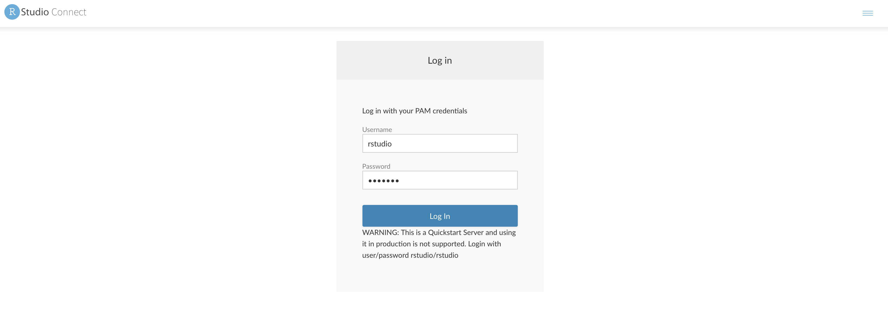
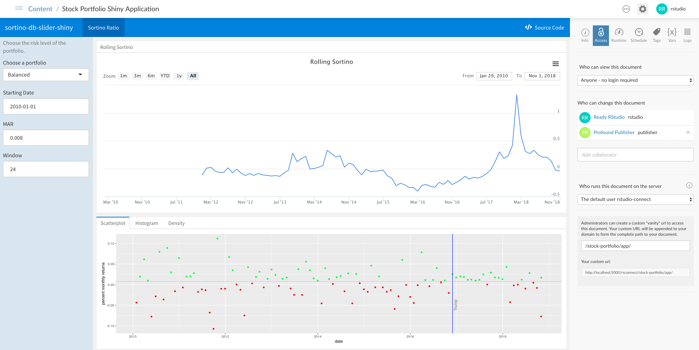

In the following sections, we'll explore the full functionality of RStudio Connect.

You can follow through the tasks in sequential order, starting with user tasks and continuing to administrator tasks. Or, you can jump directly to a task and perform the steps described in that section.

## Getting Started

First, we'll log in and view the data products that have been published to RStudio Connect.

### Logging in

Navigate to the <a href="rsconnect/" target="_blank">RStudio Connect interface</a>.

Click the `Log In` link on the top right corner of the `Welcome to RStudio Connect` page.

Log in with the account username `rstudio` and password `rstudio`, which has administrator priviledges.

Note: The `rstudio` user is has administrator privileges. There are three roles on RStudio Connect and, each has its own unique login:

* **Viewer** can see and interact with content. Username and password: `viewer`.
* **Publisher** all the rights of the viewers and can also create and manage content. Username and password: `publisher`.
* **Administrator** all the rights of the publishers and can also manage the service. Username and password: `rstudio`.

### Exploring the landing page

Once you are logged in to RStudio Connect, you'll see a landing page with a list of all of the content that has been published:

### Content types

The RStudio Connect QuickStart comes pre-populated with apps, reports, and API's.

* **Shiny**. Host, manage, and scale your Shiny applications.
* **R Markdown**. Schedule and distribute your R Markdown documents reports.
* **Plumber API's**. Expose any R function as an API.

## Explore Content

### Stocks Shiny Application

Click on the published document called `Stock Portfolio Shiny Application`, which will open the published Shiny app in the content portion of the screen along with controls for the application on the right side of the screen.

Explore the Shiny application by:

1) Hovering over different dates in the time series to view the Sortino Ratio for a given date
2) Changing the zoom level of the data for different ranges
3) Switching to different tabs along the bottom to view the data as a scatterplot, histogram, or density plot.
4) Changing the parameters on the left in terms of portfolio risk level, starting date, MAR, and window.

### Stocks R Markdown Report

Describe the R Markdown report. 

### Stocks Plumber API

From the RStudio Connect landing page, click on the published API called `Stock Information Plumber API`, which will open the published API and show the endpoints that are available. In this published API, there are two endpoints that can be queried.

Let's query the `/price` endpoint to get historical prices for a given ticker symbol.

1) Click the `/price` bar near the bottom of the screen to expand the details of the endpoint.
2) Click the `Try it Out` button to show the fields for the inputs to the API endpoint.
3) Enter `AAPL` in the `ticker` field.
4) Click the execute button to submit a request to the API endpoint.

The results of the query appear in the response body field, which shows the historical returned as a JSON object. This API could be queried by other published assets or consumed by systems external to RStudio Connect using API tokens.

## User Exercises

RStudio Connect is powered by R, so it knows how to run all of your data products. Perform these tasks in RStudio Connect.

### Add collaborators

Open the stocks Shiny application.

On the right side of the screen, you'll see an `Access` pane that defines which types of users can access the published version of the Shiny app and who can make changes to the document.

Let's add a collaborator to this Shiny app.

1) Using the `Access` pane, add the user `publisher` as a collaborator by typing their username in the field under `Who can change this document`.
2) Click the `publisher` user to add them as a collaborator to this project.

Now, the `publisher` user has the ability to manage and update this application.

### Scale your Shiny app

### Email your reports

This QuickStart ships with an email client. Open the Stocks R Markdown Report.

From the RStudio Connect landing page, click on the published document called `Stock Portfolio Report`, which will open the published report. This parameterized document contains multiple inputs that can be varied, then the report can be re-run and the output can be saved as new versions of the report.

Let's change some of the parameters and send a copy of the report via email.

1) Click the `Input` drawer on the left side of the report.
2) Change the `Start Date` to `2010-02-01`.
3) Change the `portfolio` field to `aggressive_portfolio_returns`.
4) Click the `Run Report` button.
5) After the new output is shown, click the `Save` button, enter a name for the new report, and click `OK`.
6) On the top right navigation bar, click the email icon.
7) Click the `Send` button to send a copy of the report via email.

Navigate to the <a href="webmail/" target="_blank">webmail interface</a> in the QuickStart. You'l see an email that contains the latest results from the report along with attached versions of the report in HTML and spreadsheet format.

Note that you can also schedule reports to be saved or sent by email to a list of users on a recurring basis using the `Schedule` tab in the project settings.

### Schedule your report

## Publishing

(do we really want this section?)

Use the RStudio IDE to build data products and publish them to RStudio Connect.

### How does publishing work

Push button publishing is one way to publish. Here is how it works.

* Builds a manifest
* Ships it to RStudio Connect
* Recreates the environment

### Try it out

You can configure the RStudio IDE on your local machine with the capability to publish projects to the instance of RStudio Connect in the QuickStart. Once configured, you can use push-button publishing to deploy your own applications to RStudio Connect.

1) From the RStudio IDE on your local machine, create a new R Notebook and save the notebook to a file. You can also use your own sample project in the following steps.
2) Click the RStudio Connect `Publish` button to prepare the project for publishing.
3) Click `Next` in the dialog to continue to the step for configuring the RStudio Connect URL.
4) For the public URL of the RStudio Connect server, enter `http://localhost:5000/rsconnect`.
5) In the `Connect to R` browser window that opens, click the `Connect` button and login with the username `rstudio` and password `rstudio`.
6) In the RStudio IDE, click on the `Connect Account` button to complete the authentication process.

Now that we've added an account for RStudio Connect to your RStudio IDE, we can continue to the steps to publish the R Notebook.

1) In the `Publish to Server` dialog, select the R Notebook that you want to publish. You can also select any files that are required for the notebook or project to run on RStudio Connect.
2) Click the Publish button.

After a few moments, you'll be directed to the published version of your project on RStudio Connect.

## Administrator Exercises

The tasks in this section would be performed by an administrator user in RStudio Connect.

### Managing users

From the RStudio Connect landing page, click on the `People` item in the top navigation bar.

You'll see a list of all users who have registered accounts in RStudio Connect.

You can click on a particular user to view a list of content published by that user, and you have the ability to edit fields or lock access to their user account.

### Monitoring usage metrics

From the RStudio Connect landing page, click on the `Admin` item in the top navigation bar.

You'll see an administrator dashboard with information about the CPU and RAM usage on RStudio Connect, the number of active users and Shiny connections, and a list of processes that are running alongside published content.

You can change the range to view RStudio Connect activity in terms of recent hours, days, weeks, and more.

### Adding tags to content

From the RStudio Connect landing page, click on the `Admin` item in the top navigation bar, then click the `Tags` item to view a list of tags that have been defined.

1) Add a new category by clicking the `New Category` button on the top right of the screen and entering a name for the category.
2) Add a tag under a category by clicking `New tag` under a category and entering a name for the tag.

Tags can be selected by owners or collaborators on a per-project basis. Users can use these tags from the landing page to filter for certain projects.

The tag schema can be customized in any way that maps to your organization's needs.

### View audit logs

From the RStudio Connect landing page, click on the `Admin` item in the top navigation bar, then click the `Audit Logs` item to view a history of the activity that has been performed on RStudio Connect.

### View system information

From the RStudio Connect landing page, click on the `Documentation` item in the top navigation bar. You can view a list of available R versions that have been configured with RStudio Connect.

Click on the `Server API Reference` link to view documentation related to various APIs that can be used to programmatically obtain audit logs, create published projects, gather statistics for published apps, and more.

