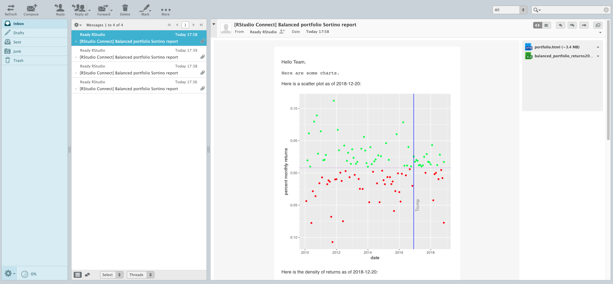
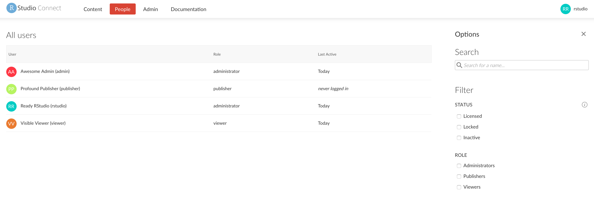

In the following sections, we'll explore the full functionality of RStudio Connect.

You can follow through the tasks in sequential order, starting with user tasks and continuing to administrator tasks. Or, you can jump directly to a task and perform the steps described in that section.

## Getting Started

### Logging in

Let's log in to RStudio Connect and view the data products that have been published.

1) Navigate to the <a href="rsconnect/" target="_blank">RStudio Connect interface</a>.
2) Click the `Log In` link on the top right corner of the `Welcome to RStudio Connect` page.

    

3) Log in with the account username `rstudio` and password `rstudio`, which has administrator privileges.

    

### Exploring the landing page

Once you are logged in to RStudio Connect, you'll see a landing page and the content that has been published:


The RStudio QuickStart is pre-populated with apps, reports, and APIs that have been published.

* **Shiny Apps**. Host, manage, and scale your Shiny applications.
* **R Markdown Documents**. Schedule and distribute your R Markdown documents and reports.
* **Plumber APIs**. Expose any R function as an API.

### Default accounts and roles

The RStudio QuickStart is pre-populated with multiple users, each with a different role and credentials:

* A **Viewer** can view and interact with content.
    * The username is `viewer` and password is `viewer`.
* A **Publisher** has all the rights of the viewers and can also publish and manage content. 
    * The username is `publisher` and password is `publisher`.
* An **Administrator** has all the rights of the publishers and can also manage users and server settings.
    * The username is `rstudio` and password is `rstudio`.

## Explore Content

### Shiny Application

RStudio Connect can host, manage, and scale your Shiny applications in production.

Let's interact with a published Shiny app to explore stock portfolio data.


1) From the RStudio Connect landing page, click on the published document called `Stock Portfolio Shiny Application`.
2) Hover over different dates in the time series plot to view the Sortino Ratio for a given date.
3) Change the zoom level of the data to view different date ranges.
4) Switch to different tabs along the bottom to view the data as a scatterplot, histogram, or density plot.
5) Change the parameters on the left pane to vary the portfolio risk level, starting date, MAR, and window.

### R Markdown Report

R Markdown documents and notebooks can be published to RStudio Connect, then scheduled and distributed to other viewers within your organization.

Let's explore a published R Markdown report and vary some of the report parameters.


1) From the RStudio Connect landing page, click on the published document called `Stock Portfolio Report`.
2) Click on the `Input` drawer on the left side of the screen to view the parameters for the report.
3) Change some of the parameters such as the date or portfolio.
4) Press the `Run Report` button to regenerate the report with the updated parameters.
5) Once the new report is generated, you can press the `Save As` button to save the newly generated report.

### Plumber API

RStudio Connect can host APIs that wrap functions in your existing models and code. The APIs can then be called from other projects published to RStudio Connect or queried from external systems or languages.

Let's view and query a published API to obtain historical prices for a given stock ticker symbol.


1) From the RStudio Connect landing page, click on the published API called `Stock Information Plumber API`.
1) Click the `/price` bar near the bottom of the screen to expand the details of the endpoint.
2) Click the `Try it Out` button to show the fields for the inputs to the API endpoint.
3) Enter `AAPL` in the `ticker` field.
4) Click the execute button to submit a request to the API endpoint.

The results of the query appear in the response body field, which shows the historical returned as a JSON object. This API could be queried by other published assets or consumed by systems external to RStudio Connect using API tokens.

## User Exercises

RStudio Connect is powered by R and has the ability to run all of your data products in production and allow them to be used by other people within your organization.

The tasks in this section would be performed by a user in RStudio Connect.

### Adding collaborators

For each deployed project, you can define users that can view the published version of content and users that can make changes to the content.

Let's add a collaborator to a Shiny application and give them the ability to view and make changes to the application.


1) From the RStudio Connect landing page, click on the published document called `Stock Portfolio Shiny Application`.
2) Click the `Access` tab in the project settings on the right side of the screen.
3) Add the user `publisher` as a collaborator by typing their username in the field under `Who can change this document`.
4) Click the `publisher` user to add them as a collaborator to this project.

Now, the `publisher` user has the ability to view, manage, and update this application.

### Scaling Shiny apps

RStudio Connect allows you to manage the runtime and performance settings of published Shiny applications.

Let's change the runtime settings for a Shiny app to allow it to handle more traffic and viewers.


1) From the RStudio Connect landing page, click on the published document called `Stock Portfolio Shiny Application`.
2) Click the `Runtime` tab in the project settings on the right side of the screen.
3) Under `Runtime settings`, choose the `Specify custom settings` option.
4) Set the `Max processes` to `5`.
5) Set the `Max connections per process` to `10`.
6) Click the `Save` button.

After configuring these new runtime settings, the Shiny app will scale up as needed to handle a higher number of concurrent users and connections.

### Sending reports by email

In RStudio Connect, parameterized documents in R Markdown can be published with multiple inputs that can be varied. These reports can be re-run with new parameters, saved as a new report version, then the output can be emailed to others.

Let's change some of the parameters in a published R Markdown report, then send a copy of the report via email.


1) From the RStudio Connect landing page, click on the published document called `Stock Portfolio Report`.
2) Click the `Input` drawer on the left side of the report.
3) Change the `Start Date` to `2010-02-01`.
4) Change the `portfolio` field to `aggressive_portfolio_returns`.
5) Click the `Run Report` button.
6) After the new output is shown, click the `Save As` button, enter a name for the new report, and click `OK`.
7) On the top right navigation bar, click the email icon.
8) Click the `Send` button to send a copy of the report via email.



Navigate to the <a href="webmail/" target="_blank">webmail interface</a> in the QuickStart. You'll see an email that contains the latest results from the report along with attached versions of the report in HTML and spreadsheet format.

### Scheduling report outputs

You can schedule reports to be saved or sent by email to a list of users on a recurring basis.

From the RStudio Connect landing page, click on the published document called `Stock Portfolio Report`.


1) Click the `Schedule` tab in the project settings on the right side of the screen.
2) Check the box to `Schedule output for default`.
3) Choose a `Schedule type` such as `Daily`.
4) Check the option to `Send email after update`.
5) Click the `Save` button, then your report will re-run, publish the new output, and send an email update.

Navigate to the <a href="webmail/" target="_blank">webmail interface</a> in the QuickStart. You'll see an email that contains the latest results from the report along with attached versions of the report in HTML and spreadsheet format.


## Administrator Exercises

RStudio Connect helps administrators provide centralized tooling around R for users to publish data products and scale them up for use by other people within your organization.

The tasks in this section would be performed by an administrator user in RStudio Connect.

### Managing users

From the RStudio Connect landing page, click on the `People` item in the top navigation bar.



You'll see a list of all users who have registered accounts in RStudio Connect.

You can click on a particular user to view a list of content published by that user, and you can also edit user fields or lock access to their user account.

### Monitoring usage metrics

From the RStudio Connect landing page, click on the `Admin` item in the top navigation bar.


You'll see an administrator dashboard with information about the CPU and RAM usage on RStudio Connect, the number of active users and Shiny connections, and a list of processes that are running alongside published content.

You can change the date/time range to view RStudio Connect activity in terms of recent hours, days, weeks, and more.

### Setting vanity app URLs

1) From the RStudio Connect landing page, click on the published document called `Stock Information Plumber API`.
2) Click the `Access` tab in the project settings on the right side of the screen.
3) Change the vanity URL for the API to `/stock-portfolio/api/v1/`.
4) Click the `Save` button.

Now, you can access the stock information API by visiting the [new vanity URL](http://localhost:5000/rsconnect/stock-portfolio/api/v1/__swagger__/) in your browser.

### Adding tags to content

From the RStudio Connect landing page, click on the `Admin` item in the top navigation bar, then click the `Tags` item to view a list of tags that have been defined.


1) Add a new category by clicking the `New Category` button on the top right of the screen and entering a name for the category.
2) Add a tag under a category by clicking `New tag` under a category and entering a name for the tag.

Tags can be selected by owners or collaborators on a per-project basis. Users can use these tags from the landing page to filter for certain projects.

The tag schema can be customized in any way that maps to your organization's needs.

### Viewing audit logs

From the RStudio Connect landing page, click on the `Admin` item in the top navigation bar, then click the `Audit Logs` item to view a history of the activity that has been performed on RStudio Connect.


### Viewing system information

From the RStudio Connect landing page, click on the `Documentation` item in the top navigation bar. You can view a list of available R versions that have been configured with RStudio Connect.


Click on the `Server API Reference` link to view documentation related to various APIs that can be used to programmatically obtain audit logs, create published projects, gather statistics for published apps, and more.


## Publishing Content

Users can configure their RStudio Desktop IDE or RStudio Server Pro to easily publish content to RStudio Connect with the click of a button.


You can configure the RStudio Desktop IDE on your local machine to publish to RStudio Connect in the QuickStart. This allows you to try push-button publishing for your own content. Refer to the documentation to connect your [RStudio IDE to RStudio Connect](http://docs.rstudio.com/connect/user/connecting.html).

The URL of the RStudio Connect server in the QuickStart that you should configure is:

```
http://localhost:5000/rsconnect
```

Once you've connected the account to your RStudio IDE, you can publish content to RStudio Connect.

Note that this functionality will only work from an RStudio Desktop IDE that is running on the same machine as the RStudio QuickStart virtual machine.
